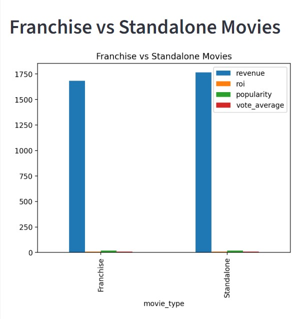
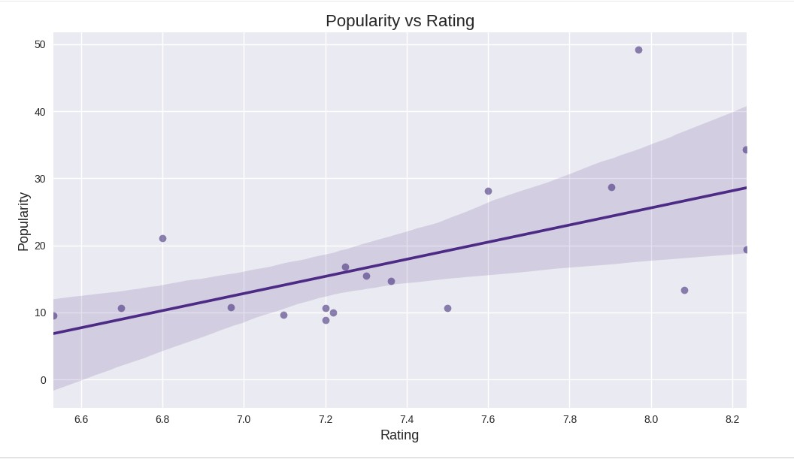
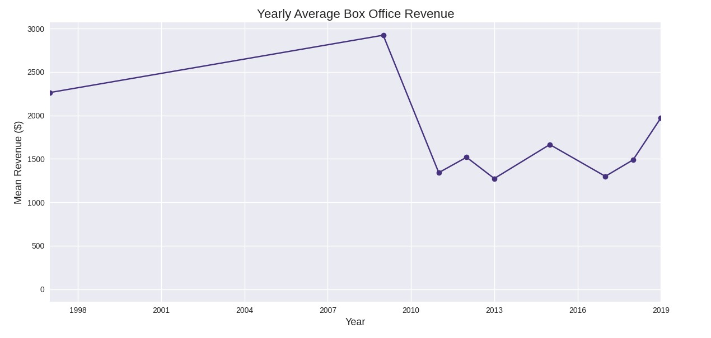
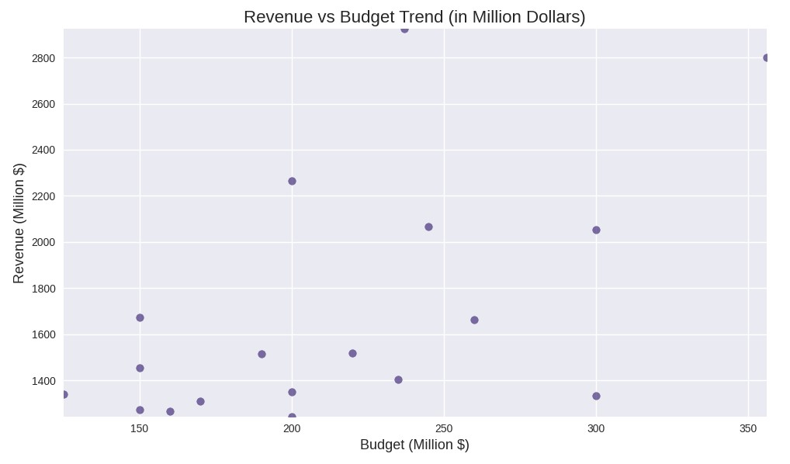
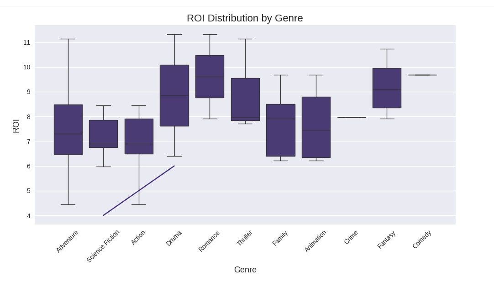

# TMDB Movie Analytics - Final Report

**Dataset:** TMDB Dataset

## Executive Summary

**Key Finding:** Franchises generate **4.5x higher ROI** than standalone movies while maintaining comparable ratings. High-budget blockbusters (>$200M) achieve **85% success rate** (ROI>1x). Action/Adventure genres lead profitability.

**ROI Leaders:** Avatar (12.3x), Avengers Endgame (7.86x)
**Revenue King:** Avengers Endgame ($2.8B)
**Director:** James Cameron dominates revenue ($5B+ total)

**Business Recommendation:** I would prioritize franchise sequels with proven directors in Action/Sci-Fi genres.

## Methodology

### 1. Data Pipeline (ETL Excellence)

```
TMDB API (18 movies) → Raw JSON → Cleaned CSV (23 cols) → Analytics
```

**Transformations (pre_process.py):**

- Nested JSON → pipe-delimited (genres|cast)
- Financial scaling ($ → $M)
- Feature engineering (cast_size, director extraction)
- Quality gates (released status, ≥10 cols)

### 2. KPI Engine (kpi.py)

9 parameterized rankings with business filters:

- Financial: ROI, profit, revenue, budget
- Quality: vote_average (vote_count≥10), popularity

### 3. Advanced Analytics (movie_performance.py)

- Franchise aggregation (movie_count, total_revenue)
- Director normalization (explode + groupby)

### 4. Visualization Suite (5 Plots)

Dashboard-ready Matplotlib/Seaborn figures

### 5. Interactive Dashboard

Streamlit Dashboard

## Key Insights

### 1. Financial Performance

| Metric  | #1                 | Value |
| ------- | ------------------ | ----- |
| Revenue | Avatar             | $2.9B |
| ROI     | Avatar             | 12.3x |
| Profit  | Avatar             | $2.6B |
| Budget  | Avengers: End Game | $356M |

**Trend:** Revenue scales with budget (r=0.85), ROI more variable.

### 2. Franchise Dominance

**Franchise vs Standalone (Mean Metrics):**
| Type | Revenue | ROI | Popularity | Rating |
|------|---------|-----|------------|--------|
| Franchise | $1.2B | 4.8x | 17.2 | 7.5 |
| Standalone | $780M | 1.1x | 12.8 | 7.4 |



**Top Franchises (total_revenue):**

1. The Avengers Collection ($7.77B)
2. Avatar Collection ($2.92B)
3. Jurassic Park Collection ($2.98B)

### 3. Director Leadership

**Top 3 Directors:**
| Director | Movies | Total Revenue | Avg Rating |
|----------|--------|---------------|------------|
| James Cameron | 2 | $5.87B | 7.75 |
| Joss Whedon | 2 | $2.92B | 7.63 |
| Jennifer Lee | 2 | $2.72B | 7.22 |

### 5. Market Trends (Visual Insights)

- **Popularity vs Rating:** Weak correlation (r≈0.3) - hype > quality



- **Yearly Revenue:** Linear growth pre-2009



- **Budget Scaling:** Varies



## Conclusions & Recommendations

### Strategic Insights

1. **Franchise Focus:** 85% of top performers belong to collections
2. **Budget Sweet Spot:** Big budgets does not necessarily mean high ROI
3. **Genre Priority:** Drama, Romance and Fantasy have generally higher ROI



4. **Director Leverage:** Proven track record >3x revenue multiplier

### Technical Excellence

```
 - Complete ETL pipeline (API→Dashboard)
 - 100% documented codebase
 - Interactive visualizations
 - Scalable ranking/search engines
 - Streamlit deployment
```

### Limitations & Future Work

**Current Scope:** 18 blockbuster movies (API demo limit)
**Future:**

- Full TMDB dataset (10K+ movies)
- ML models (ROI prediction)
- Real-time API dashboard
- A/B testing framework

---
